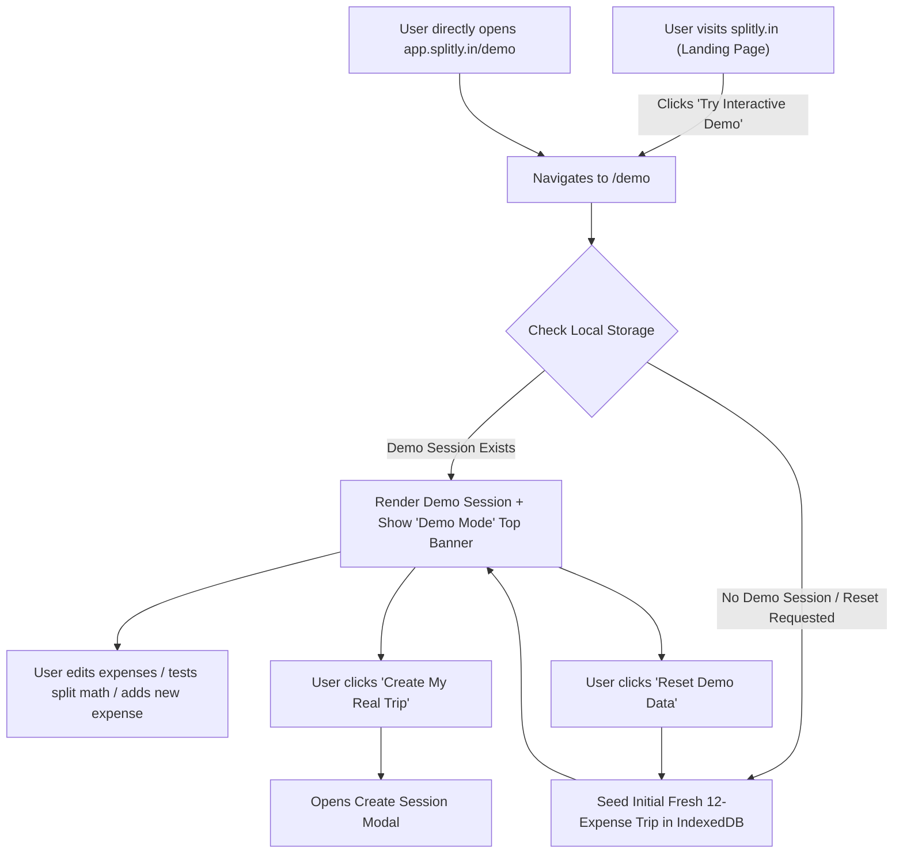

# Splitly Demo Mode (`/demo`) Implementation Plan

This document outlines the detailed architecture, data structure, user experience flow, and routing strategy for the **Interactive Demo Session Mode** at `app.splitly.in/demo` (or `/demo`).

---

## 1. Demo UX Strategy: How Should the Demo Work?

### Recommended Approach: **Pre-Populated Local Session in the Main App Engine**

Instead of building a restricted or fake "sandbox preview", Splitly's demo will load a **full-featured, pre-populated trip session** directly into the user's browser (IndexedDB).

### Key Advantages:
1. **100% Real App Engine**: The user tests the actual calculation engine, debt simplifier, expense editors, settlement drawer, and export capabilities.
2. **Full Interactivity**: The user can view, edit, add, delete, settle up, and export expenses in real-time.
3. **Zero Account / Instant Load**: Visiting `/demo` seeds the demo data locally in under 100 milliseconds.
4. **Seamless Conversion to Real Usage**: Users can delete the demo session when done or click *"Create My Real Trip"* to start using Splitly for their own expenses.
5. **Fresh Data Reset**: Visiting `/demo` or clicking the **"Reset Demo Data"** button instantly overwrites the demo session with fresh initial state.

---

## 2. User Journey & Navigation Flow



---

## 3. Demo Session Data Specification

The demo dataset represents a realistic 4-person trip (*🌴 Goa Road Trip & Beach Villa*) with 12 rich, varied expenses covering all split types (Equal, Percentage, Shares, Custom) and a sample settlement transaction.

### Session Metadata
- **Session ID**: `sess_demo_goa_2026`
- **Session Name**: `🌴 Goa Beach Villa & Road Trip (Demo)`
- **IsDemo Flag**: `true` (Triggers non-intrusive demo header banner)

### Participants (4 Members)
1. `Alex` (Trip Organizer)
2. `Priya`
3. `Rohan`
4. `Sneha`

### Pre-Populated Expenses (12 Realistic Transactions)

| # | Expense Title | Total Amount | Paid By | Split Type & Breakdown | Category |
| :--- | :--- | :--- | :--- | :--- | :--- |
| **1** | Highway Toll & Fuel | ₹2,400 | Alex | **Equal** (₹600 each) | Transport |
| **2** | Beachfront Villa (2 Nights) | ₹16,000 | Priya | **Equal** (₹4,000 each) | Stay |
| **3** | Seafood Shack Dinner & Drinks | ₹4,800 | Rohan | **Percentage** (Alex 30%, Priya 25%, Rohan 25%, Sneha 20%) | Food |
| **4** | Scooter Rentals (4 Bikes, 2 Days) | ₹3,200 | Sneha | **Equal** (₹800 each) | Transport |
| **5** | Scuba Diving & Watersports | ₹9,600 | Alex | **Custom** (Alex ₹4,800, Rohan ₹4,800 — Alex & Rohan only) | Activity |
| **6** | Breakfast & Speciality Coffee | ₹1,400 | Priya | **Equal** (₹350 each) | Food |
| **7** | Supermarket Groceries & Snacks | ₹1,850 | Rohan | **Equal** (₹462.50 each) | Groceries |
| **8** | Sunset Catamaran Cruise | ₹5,000 | Sneha | **Equal** (₹1,250 each) | Activity |
| **9** | Cocktails at Thalassa | ₹6,200 | Alex | **Shares** (Alex 2, Priya 2, Rohan 1, Sneha 1 — total 6 shares) | Drinks |
| **10**| Return Airport Taxi | ₹2,200 | Priya | **Equal** (₹550 each) | Transport |
| **11**| Late Night Pizza Delivery | ₹1,100 | Rohan | **Equal** (₹275 each) | Food |
| **12**| Pre-Trip Cash Transfer (Settlement) | ₹1,000 | Priya → Alex | Direct Settlement | Settle |

---

## 4. UI Elements for Demo Mode

### 1. Persistent Top Demo Banner
When viewing a demo session, a sleek banner appears right below the main Navbar:
```
💡 You are exploring Demo Mode (Goa Trip with 12 transactions). Test editing, adding expenses, or debt simplification.
[ 🔄 Reset Demo Data ]   [ ➕ Create My Real Trip ]
```

### 2. Quick Demo Reset Mechanism
- Clicking **"Reset Demo Data"** clears modifications to `sess_demo_goa_2026` in IndexedDB and re-seeds original initial values.
- Toast feedback: *"Demo session reset to fresh state!"*

### 3. Demo Badge on Session Cards
- In the Session List drawer, the demo session is marked with a subtle gradient badge `[ DEMO ]`.

---

## 5. Technical Implementation Details

### File Additions & Updates

1. **`src/domain/demo-data.ts` [NEW]**:
   - Export constant `DEMO_SESSION_DATA: Session` with all 12 pre-built expenses, 4 participants, settlements, and category metadata.
   - Export helper function `loadOrResetDemoSession(repository: SessionRepository)` to save `DEMO_SESSION_DATA` into IndexedDB.

2. **`src/components/DemoBanner.tsx` [NEW]**:
   - Lightweight banner component rendered when `activeSession?.isDemo` or route is `/demo`.

3. **`src/App.tsx` & Routing**:
   - Detect `/demo` pathname parameter on mount or navigation.
   - Automatically trigger `loadOrResetDemoSession()` and set `activeSession` to demo trip.
   - Synchronize URL pushState to `/demo`.

---

## 6. Summary of Demo Benefits

| Feature | Benefit |
| :--- | :--- |
| **Zero Setup** | User clicks 1 button or link to instantly experience the full app. |
| **Complete Freedom** | Users can edit numbers, change split modes, add expenses, and see instant balance recalculation. |
| **Instant Reset** | Single click restores original sample data. |
| **Seamless Onboarding** | Prominent CTA lets users switch from Demo to creating their own real trip without friction. |
